<a href="https://ibrahimelmasry.github.io/"><picture><source media="(max-width: 640px)" srcset="assets/cinema/button-play-mobile.svg"></picture></a>
<a href="#the-catalog"><picture><source media="(max-width: 640px)" srcset="assets/cinema/button-catalog-mobile.svg"></picture></a>
<a href="https://wa.me/201019804919"><picture><source media="(max-width: 640px)" srcset="assets/cinema/button-contact-mobile.svg"></picture></a>

**I'm Ibrahim Tarek, a Lead Software Engineer and ASP.NET & Full Stack Developer / UI Architect.** I engineer scalable enterprise backends, high-performance web systems, and modern interactive UI architectures, connecting clean architecture and robust database design with polished user experiences.

<picture><source media="(max-width: 640px)" srcset="assets/cinema/section-ai-mobile.svg"></picture>

<strong>Explore Enterprise &amp; Backend Systems · project notes, stack &amp; source</strong>

| Project | The story | Built with |
| :--- | :--- | :--- |
| **[DevERP](https://github.com/IbrahimElmasry/DevERP)** | Comprehensive Enterprise Resource Planning (ERP) platform designed for business process management, inventory, operations oversight, and process automation with robust Clean Architecture. | ASP.NET Core, C#, Entity Framework Core, SQL Server, Clean Architecture |
| **[Elwakeel-LawFirm](https://github.com/IbrahimElmasry/Elwakeel-LawFirm)** | Secure legal case management solution and corporate client portal with role-based access control, court session tracking, and document organization. | ASP.NET Core, C#, Web API, SQL Server, Bootstrap |
| **[rawafid](https://github.com/IbrahimElmasry/rawafid)** | Scalable enterprise solution and web portal delivering reliable business operations, modular backend services, and high-performance APIs. | ASP.NET Core, REST APIs, EF Core, SQL Server |

<picture><source media="(max-width: 640px)" srcset="assets/cinema/section-web-mobile.svg"></picture>

<strong>Explore the interface collection · live experiences &amp; source</strong>

- **Blazor Portfolio** — interactive UI architecture, component-driven design, and responsive web experiences. [Live Portfolio](https://ibrahimelmasry.github.io/) · [Source](https://github.com/IbrahimElmasry/IbrahimElmasry.github.io)
- **rawafid Portal** — enterprise web interface and business management dashboard. [Source](https://github.com/IbrahimElmasry/rawafid)
- **[Browse all repositories](https://github.com/IbrahimElmasry?tab=repositories)** for more enterprise backends, web APIs, and UI architecture.

<picture><source media="(max-width: 640px)" srcset="assets/cinema/stack-mobile.svg"></picture>

<strong>Behind the scenes · background &amp; credentials</strong>

My engineering path connects backend system design, database optimization, and modern UI engineering. I specialize in designing high-throughput, maintainable software systems from backend database schemas to polished client interfaces.

- **Lead Software Engineer & UI Architect** — Leading application architecture, code standards, and full-stack integration.
- **Enterprise System Architecture** — Clean Architecture, Domain-Driven Design (DDD), CQRS, Repository Pattern.
- **Digital Egypt Pioneers Initiative (DEPI)** — Enterprise .NET Core Development.
- **Database Design & Optimization** — Microsoft SQL Server, PostgreSQL, relational modeling, performance indexing.
- **[Portfolio](https://ibrahimelmasry.github.io/)** · **[CV](Ibrahim%20Tarek%20Data/Ibrahim%20Tarek%20CV.pdf)**

<a href="https://wa.me/201019804919"><picture><source media="(max-width: 640px)" srcset="assets/cinema/credits-mobile.svg"></picture></a>

<a href="https://www.linkedin.com/in/ibrahim-tarek-62b0a62a4/"><strong>LinkedIn</strong></a> &nbsp; / &nbsp;
<a href="https://ibrahimelmasry.github.io/"><strong>Portfolio</strong></a> &nbsp; / &nbsp;
<a href="https://wa.me/201019804919"><strong>WhatsApp</strong></a> &nbsp; / &nbsp;
<a href="https://www.facebook.com/professur.ibrahim"><strong>Facebook</strong></a> &nbsp; / &nbsp;
<a href="https://github.com/IbrahimElmasry?tab=repositories"><strong>All projects</strong></a>

Ibrahim Tarek · Lead Software Engineer &amp; UI Architect

