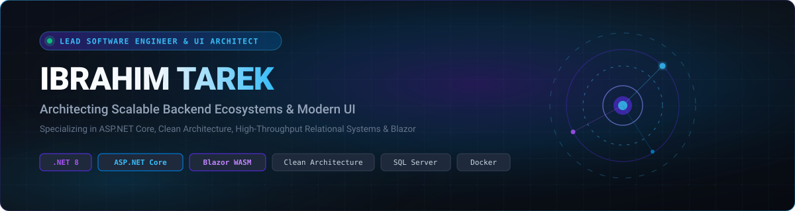
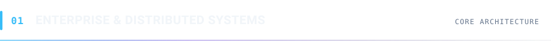
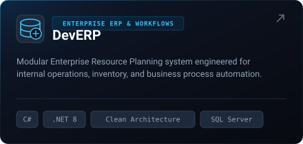
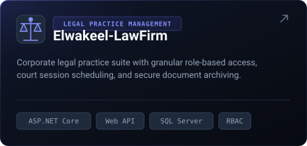
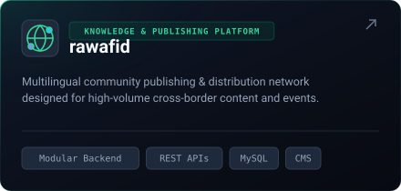

  
  
    
  
  
  &nbsp;
  
  &nbsp;
  
  &nbsp;
  

 

### ⚡ Architecture &amp; Systems Engineering

**I'm Ibrahim Tarek, a Lead Software Engineer and UI Architect based in Alexandria, Egypt.**

I specialize in architecting distributed enterprise backend systems, scalable relational databases, and modern component-driven web interfaces. My engineering philosophy revolves around **Clean Architecture**, **Domain-Driven Design (DDD)**, and strict separation of concerns — delivering high-throughput, maintainable software ecosystems built with **C#**, **.NET 8 / ASP.NET Core**, **Entity Framework Core**, **SQL Server**, and **Blazor WebAssembly**.

---

  <table width="100%" border="0" cellspacing="10" cellpadding="0">
    <tr>
      <td width="50%" align="center" valign="top">
        
      </td>
      <td width="50%" align="center" valign="top">
        
      </td>
    </tr>
  </table>

---

  <table width="100%" border="0" cellspacing="10" cellpadding="0">
    <tr>
      <td width="50%" align="center" valign="top">
        
      </td>
      <td width="50%" align="center" valign="top">
        
      </td>
    </tr>
  </table>

---

<strong>📐 Architectural Deep Dives · Core System Breakdown</strong>

 

| Enterprise System | Architecture &amp; Key Design Decisions | Core Technology Stack |
| :--- | :--- | :--- |
| **[DevERP](https://github.com/IbrahimElmasry/DevERP)** | Modular Enterprise Resource Planning system engineered with Clean Architecture. Implements decoupled business logic layers, inventory lifecycle tracking, financial workflows, and automated reporting pipelines. | `C#`, `.NET 8`, `ASP.NET Core`, `Clean Architecture`, `EF Core`, `SQL Server` |
| **[Elwakeel-LawFirm](https://github.com/IbrahimElmasry/Elwakeel-LawFirm)** | Full-scale legal practice management and client corporate portal. Features granular Role-Based Access Control (RBAC), case workflow lifecycle tracking, court hearing scheduling, and document vault encryption. | `ASP.NET Core`, `C#`, `RESTful Web APIs`, `SQL Server`, `Bootstrap 5`, `JavaScript` |
| **[rawafid](https://github.com/IbrahimElmasry/rawafid)** | High-availability multilingual publishing platform and event distribution network. Built with modular service boundaries, high-throughput caching, and robust relational data management. | `Modular Backend`, `REST APIs`, `MySQL / Relational DB`, `CMS Architecture` |
| **[IbrahimElmasry.github.io](https://github.com/IbrahimElmasry/IbrahimElmasry.github.io)** | Interactive single-page application portfolio powered entirely by client-side Blazor WebAssembly. Features custom component lifecycle states, ahead-of-time (AOT) rendering, and zero JavaScript-runtime dependency for core logic. | `Blazor WebAssembly`, `.NET 8`, `C# Component Architecture`, `Tailwind CSS` |

<strong>🛠️ Categorized Technical Stack Breakdown</strong>

 

- **Backend &amp; Core Architecture:**
  - `C#`, `.NET 8 / 9`, `ASP.NET Core Web API`, `ASP.NET MVC`
  - `Clean Architecture`, `Domain-Driven Design (DDD)`, `CQRS Pattern`, `Repository & Unit of Work`
  - `Entity Framework Core`, `Dapper`, `LINQ Optimization`
  - `Authentication & Authorization (JWT, Identity, Claims, RBAC)`

- **UI &amp; Frontend Systems:**
  - `Blazor WebAssembly (WASM)`, `Blazor Server`, `Razor Components`
  - `TypeScript`, `Modern JavaScript (ESNext)`, `HTML5 / Semantic Web`
  - `Tailwind CSS`, `Bootstrap 5`, `Responsive UI Design & Design Systems`

- **Databases &amp; Caching:**
  - `Microsoft SQL Server (T-SQL, Stored Procedures, Views, Index Tuning)`
  - `PostgreSQL`, `MySQL`, `Redis (In-Memory Caching & Session Stores)`

- **DevOps, Tooling &amp; Quality:**
  - `Docker & Containerization`, `Git & GitHub Workflows / Actions`
  - `IIS & Windows Server Deployment`, `Azure App Services`
  - `Postman / Swagger (OpenAPI)`, `Unit Testing (xUnit, Moq, FluentAssertions)`

<strong>🎓 Engineering Leadership &amp; Background</strong>

 

- **Lead Software Engineer &amp; UI Architect** — Specializing in full-stack architecture, software scalability, and engineering standards.
- **Digital Egypt Pioneers Initiative (DEPI)** — Enterprise .NET Core Development &amp; Software Engineering.
- **Bachelor's Degree in Computer Science** — Focus on algorithms, database systems, and software engineering principles.
- **Location:** Alexandria, Egypt (Open to remote and global enterprise roles).

---

  

    <a href="https://ibrahimelmasry.github.io/"><strong>🌐 Live Portfolio</strong></a> &nbsp;•&nbsp;
    <a href="https://www.linkedin.com/in/ibrahim-tarek-62b0a62a4/"><strong>💼 LinkedIn</strong></a> &nbsp;•&nbsp;
    <a href="https://wa.me/201019804919"><strong>💬 WhatsApp</strong></a> &nbsp;•&nbsp;
    <a href="https://www.facebook.com/professur.ibrahim"><strong>📘 Facebook</strong></a> &nbsp;•&nbsp;
    <a href="https://github.com/IbrahimElmasry?tab=repositories"><strong>📦 All Repositories</strong></a>
  

  Designed &amp; Architected by Ibrahim Tarek · Alexandria, Egypt

